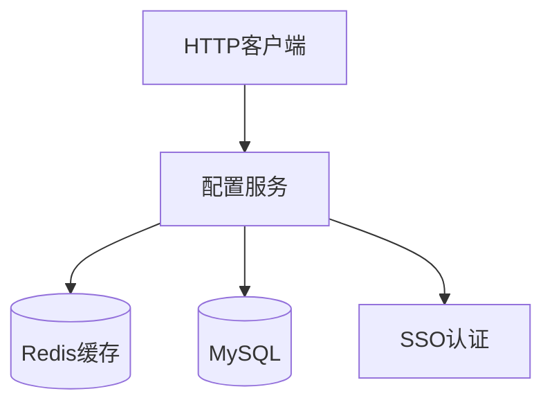
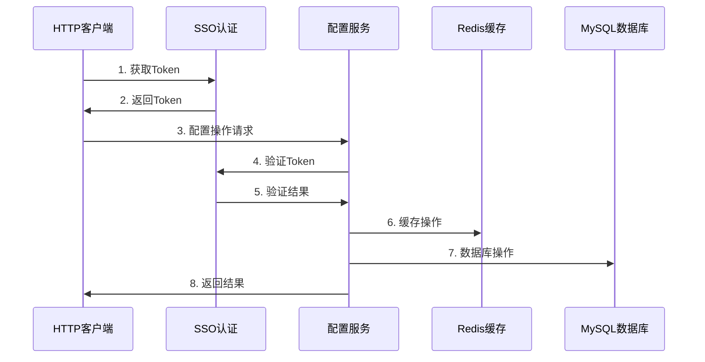

# 分布式配置中心系统设计文档

## 目录
- [1. 系统概述](#1-系统概述)
- [2. 功能需求](#2-功能需求)
- [3. 非功能需求](#3-非功能需求)
- [4. 系统架构](#4-系统架构)
- [5. 详细设计](#5-详细设计)
- [6. 数据模型](#6-数据模型)
- [7. 接口设计](#7-接口设计)
- [8. 安全设计](#8-安全设计)
- [9. 部署方案](#9-部署方案)

## 1. 系统概述

### 1.1 项目背景
配置中心系统用于集中管理应用配置，提供配置的集中存储、动态更新、版本管理等功能，解决分布式系统中配置管理的问题。

### 1.2 系统目标
- 提供高可用、高性能的配置管理服务
- 支持配置的实时更新和动态推送
- 确保配置数据的一致性和安全性
- 提供友好的配置管理界面和API

### 1.3 系统范围
- 配置的CRUD操作
- 配置版本管理
- 配置变更审计
- 配置加密存储
- 多环境支持

## 2. 功能需求

### 2.1 核心功能
1. **配置管理**
   - 配置的创建、读取、更新、删除
   - 配置分组管理
   - 配置版本控制
   - 配置回滚

2. **环境管理**
   - 多环境支持（开发、测试、生产）
   - 环境隔离
   - 环境配置同步

3. **权限控制**
   - 基于SSO的认证
   - 基于角色的权限控制
   - 操作审计日志

4. **配置加密**
   - 敏感配置加密存储
   - 加密算法可配置
   - 密钥管理

## 3. 非功能需求

### 3.1 性能需求
- 配置读取响应时间 < 100ms
- 配置更新响应时间 < 200ms
- 系统支持每秒1000+的配置读取请求
- 系统支持每秒100+的配置更新请求

### 3.2 可用性需求
- 系统可用性 99.9%
- 支持多实例部署
- 支持数据库主从复制
- 支持缓存集群

### 3.3 安全需求
- 支持SSO认证
- 支持配置加密
- 支持操作审计
- 支持访问控制

## 4. 系统架构

### 4.1 整体架构


### 4.2 技术栈
- 后端：Spring Boot 2.7.x
- 数据库：MySQL 8.0
- 缓存：Redis 6.0
- 认证：SSO
- 部署：Docker + Kubernetes

## 5. 详细设计

### 5.1 核心流程


### 5.2 缓存设计
1. **缓存策略**
   - 采用Cache-Aside模式
   - 写操作时同步更新缓存
   - 读操作优先从缓存获取

2. **缓存结构**
   ```
   config:{env}:{key} -> value
   group:{env}:{groupId} -> {configs}
   version:{env}:{key} -> version
   ```

## 6. 数据模型

### 6.1 数据库设计
```sql
-- 配置项表
CREATE TABLE config_item (
    id BIGINT PRIMARY KEY AUTO_INCREMENT,
    config_key VARCHAR(100) NOT NULL,
    config_value TEXT NOT NULL,
    description VARCHAR(500),
    environment VARCHAR(50) NOT NULL,
    version VARCHAR(50) NOT NULL,
    status VARCHAR(20) NOT NULL,
    create_time DATETIME NOT NULL,
    update_time DATETIME NOT NULL,
    UNIQUE KEY uk_key_env (config_key, environment)
);

-- 配置组表
CREATE TABLE config_group (
    id BIGINT PRIMARY KEY AUTO_INCREMENT,
    group_id VARCHAR(50) NOT NULL,
    group_name VARCHAR(100) NOT NULL,
    description VARCHAR(500),
    create_time DATETIME NOT NULL,
    update_time DATETIME NOT NULL
);

-- 配置变更记录表
CREATE TABLE config_change_log (
    id BIGINT PRIMARY KEY AUTO_INCREMENT,
    change_id VARCHAR(50) NOT NULL,
    config_key VARCHAR(100) NOT NULL,
    old_value TEXT,
    new_value TEXT,
    operator VARCHAR(50) NOT NULL,
    change_time DATETIME NOT NULL
);
```

## 7. 接口设计

### 7.1 RESTful API
```
# 配置管理
POST   /api/v1/configs          # 创建配置
GET    /api/v1/configs/{key}    # 获取配置
PUT    /api/v1/configs/{key}    # 更新配置
DELETE /api/v1/configs/{key}    # 删除配置

# 配置组管理
POST   /api/v1/groups           # 创建配置组
GET    /api/v1/groups/{id}      # 获取配置组
PUT    /api/v1/groups/{id}      # 更新配置组
DELETE /api/v1/groups/{id}      # 删除配置组

# 版本管理
GET    /api/v1/configs/{key}/versions           # 获取版本历史
POST   /api/v1/configs/{key}/versions/{version} # 回滚到指定版本
```

## 8. 安全设计

### 8.1 认证授权
- 基于SSO的统一认证
- 基于RBAC的权限控制
- API访问权限控制

### 8.2 数据安全
- 敏感配置加密存储
- 配置变更审计
- 操作日志记录

## 9. 部署方案

### 9.1 部署架构
- 服务实例至少部署2个节点
- 数据库采用主从架构
- Redis采用主从架构
- 使用负载均衡器进行流量分发

### 9.2 环境要求
- JDK 11+
- MySQL 8.0+
- Redis 6.0+
- Docker & Kubernetes 